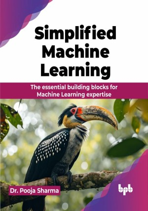

# Simplified Machine Learning

Explore the world of Artificial Intelligence with a deep understanding of Machine Learning concepts and algorithms

This is the repository for [Simplified Machine Learning
](https://bpbonline.com/products/simplified-machine-learning?variant=43817751511240),published by BPB Publications.

## About the Book
"Simplified Machine Learning" is a comprehensive guide that navigates readers through the intricate landscape of Machine Learning, offering a balanced blend of theory, algorithms, and practical applications. 

The first section introduces foundational concepts such as supervised and unsupervised learning, regression, classification, clustering, and feature engineering, providing a solid base in Machine Learning theory. The second section explores algorithms like decision trees, support vector machines, and neural networks, explaining their functions, strengths, and limitations, with a special focus on deep learning, reinforcement learning, and ensemble methods. The book also covers essential topics like model evaluation, hyperparameter tuning, and model interpretability. The final section transitions from theory to practice, equipping readers with hands-on experience in deploying models, building scalable systems, and understanding ethical considerations.

By the end, readers will be able to leverage Machine Learning effectively in their respective fields, armed with practical skills and a strategic approach to problem-solving.

## What You Will Learn
• Solid foundation in Machine Learning principles, algorithms, and methodologies.

• Implementation of Machine Learning models using popular libraries like NumPy, Pandas, PyTorch, or scikit-learn.

• Knowledge about selecting appropriate models, evaluating their performance, and tuning hyperparameters.

• Techniques to pre-process and engineer features for Machine Learning models.

• To frame real-world problems as Machine Learning tasks and apply appropriate techniques to solve them.
